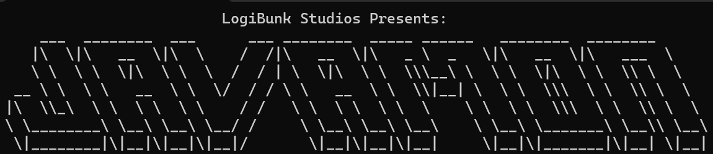

# Javamon




Javamon is a command line based game where you collect Dragons and explore! 

# World Gen

## Home
### Generation
Home spawns directly, or as close as possible, to the center of the map. 

### Dragon Types
These are the types of dragons you can expect to spawn on this tile:

 - Your mom (unfortunately not a dragon)

Yeah... shes not collectable either unfortunately. She will continue to stand in the kitchen like a broken uncoded NPC (she is).

## Grassland

### Generation
Grassland generally spawns in the middle of the map. 

### Dragon Types
It is one of the most basic tiles in the game, and garners generic types you would expect find. The types of dragons you can find here are:

 - Water
 - Wind
 - Fire
 - Nature

On this tile, there is a 90% chance that a dragon will be collected from it.

## Forest
### Generation
Forest generally spawns in with grassland. This generation is not even, however. Grassland has a 33% chance of being replaced with forest.

### Dragon Types
These are the types of dragons you can expect to spawn on this tile:

 - Water
 - Wind
 - Earth
 - Nature

On this tile, there is a 90% chance that a dragon will be collected from it.

## Swamp
### Generation
Swamp generally spawns at the bottom of the map. The closer to the bottom of the map you are, the more swamp tiles you will discover.

### Dragon Types
These are the types of dragons you can expect to spawn on this tile:

 - Water
 - Nature
 - Electric

On this tile, there is a 90% chance that a dragon will be collected from it.

## Mountain
### Generation
Mountain generally spawns at the top of the map. The closer to the top of the map you are, the more mountain tiles you will discover.

### Dragon Types
These are the types of dragons you can expect to spawn on this tile:

 - Ice
 - Earth
 - Wind
 - Water

On this tile, there is a 90% chance that a dragon will be collected from it.

## Mistlands
### Generation
Mistlands generally spawns on the left and right sides of the map, following an almost sideways like sinewave.

### Dragon Types
These are the types of dragons you can expect to spawn on this tile:

 - Water
 - Fire
 
On this tile, there is a 75% chance that a dragon will be collected from it.
The Mistlands are known for their high level creatures, so be wary of such beasts.

# Dragon Conflict
You will inevitably run into other dragons on your journey (just make sure to leave home). When you finally digitally touch grass (close enough), you will hopefully come across a dragon. 

## Fighting

In the current state, fighting dragons is a very simple process. If the level of your dragon is higher than the opposing dragon's, you will win the fight, and be able to catch the dragon. *There are no use of elements currently*.

## Catching

The process of catching is far more complicated than fighting. The catch rate is determined by the following equation:
```
catchRate = (opposingDragonLevel-(playerLevel*5)) / 4
```

The higher the catchRate value, the less likely you are to catch the pokemon (determined by a 1 in "catchRate" rule).

# Conclusion

We wish you good luck on your dragon conquests! 